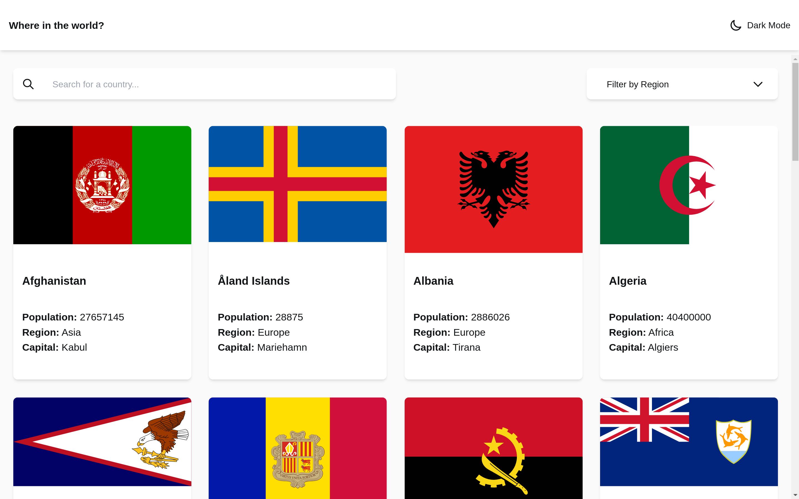

# Frontend Mentor - REST Countries API with color theme switcher solution

This is a solution to the [REST Countries API with color theme switcher challenge on Frontend Mentor](https://www.frontendmentor.io/challenges/rest-countries-api-with-color-theme-switcher-5cacc469fec04111f7b848ca). Frontend Mentor challenges help you improve your coding skills by building realistic projects.

## Table of contents

- [Overview](#overview)
  - [The challenge](#the-challenge)
  - [Screenshot](#screenshot)
  - [Links](#links)
- [My process](#my-process)
  - [Built with](#built-with)
  - [What I learned](#what-i-learned)
  - [Continued development](#continued-development)
  - [Useful resources](#useful-resources)
- [Author](#author)
- [Acknowledgments](#acknowledgments)

## Overview

### The challenge

Users should be able to:

- See all countries from the API on the homepage
- Search for a country using an `input` field
- Filter countries by region
- Click on a country to see more detailed information on a separate page
- Click through to the border countries on the detail page
- Toggle the color scheme between light and dark mode _(optional)_

### Screenshot





### Links

- Solution URL: [Github](https://github.com/Ihesiulor/country-api)
- Live Site URL: [Netlify](https://ihesiulor-countries.netlify.app/)

## My process

### Built with

- Flexbox
- CSS Grid
- Mobile-first workflow
- [React](https://reactjs.org/) - JS library
- [Tailwind CSS](https://tailwindcss.com/) - A utility-first CSS framework
- [Heroicon](https://heroicons.com/) - Beautiful hand-crafted SVG icons
- [Netlify](https://www.netlify.com/) - A serverless platform for building and deploying web apps

### What I learned

I learned a nifty way to convert a one-dimensional array into a two-dimensional array

To see how you can add code snippets, see below:

```js
const twoDArray = (arr, n) => {
  return new Array(Math.ceil(arr.length / n))
    .fill()
    .map((_) => arr.splice(0, n));
};
```

### Continued development

During the course of building this app, I found that most times I had issues properly implementing SVG icons, and so as I continue to learn and build stuff I will like to improve in this area.

### Useful resources

- [Stack Overflow](https://stackoverflow.com/) - For obvious reasons.
- [DevDocs](https://devdocs.io/) - DevDocs contains a collection of documentations i found really useful for this project.

## Author

- Website - [Ihesiulor](https://egusi.dev/)
- Frontend Mentor - [@ihesiulor](https://www.frontendmentor.io/profile/ihesiulor)
- Twitter - [@\_ihesiulor](https://www.twitter.com/_ihesiulor)

## Acknowledgments

I will like to thank [curry](https://twitter.com/princeCurie) and [linda](https://twitter.com/lindaokorie_) for pushing me to do this and for all the help they provided throughout the course of this project and the growth of my career. You guys are the best.
